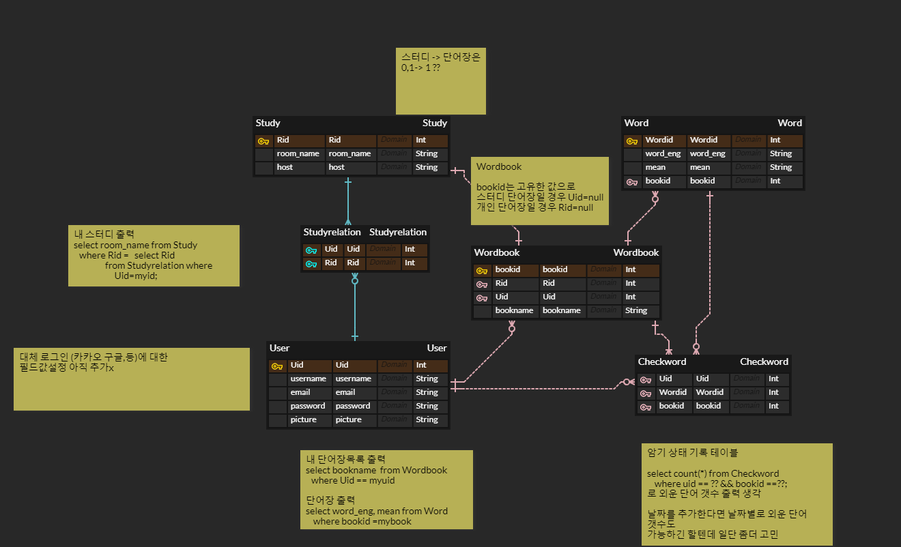
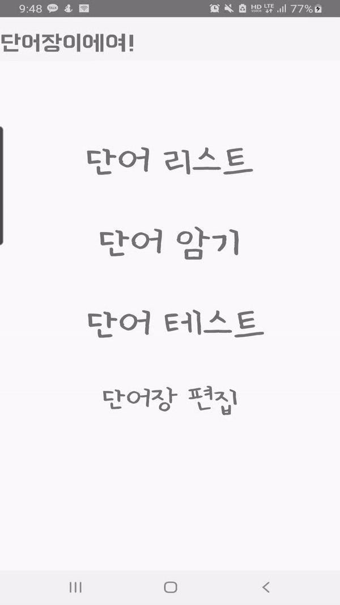
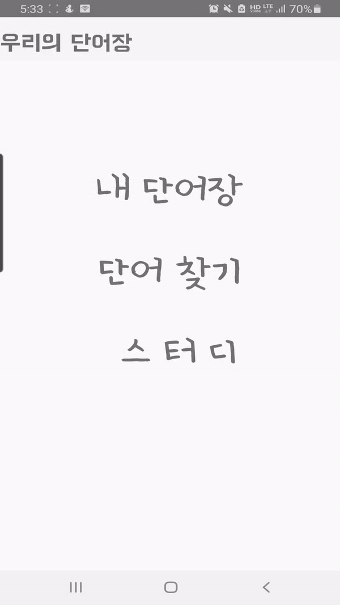
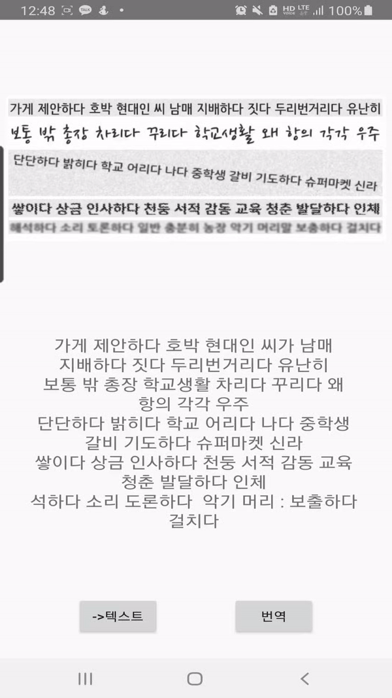
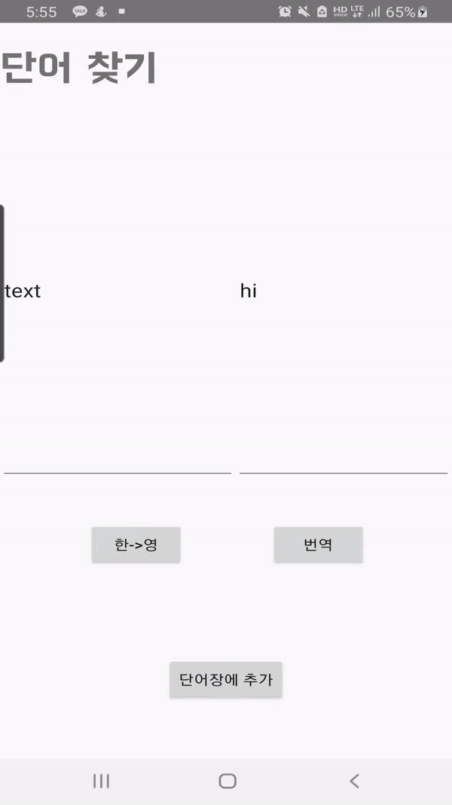

# 2021_Vocabulary-Book


## Initial plan

### draft plan

- #### motivation

  - 오고 가며 언제든지 내가 원하는 단어를 알려 줄 수 있는 단어장
  - 사진으로 찍어서 내가 자주 보는 단어장에 넣을 수 있다면?
  - 영어 단어 스터디를 할 때 도움을 주는 단어장!
  - 너무 난잡하지는 않은 어플

- #### project objectives

  - **간단하고 편한 ui**를 가진  사진 & 파일 등의 단어장의 **단어 추가 기능**과 **스터디** 원간의 단**어장 공유**와 **서로의 진행상태**를 체크할 수 있는 단어장

- #### functional

  1. 단어장 리스트
     1. 단어장
        1. 단어 리스트
           1. 전체단어
           2. 모르는단어
           3. 암기한 단어
        2. 단어 암기 (구형 형태로 랜덤하게 보여줌 터치 시 뜻 출력)
        3. 단어 테스트
        4. 단어장 편집
        5. 단어장 공유, 설정
     2. 단어장 추가
        1. 단어장 구성 ( 직접 입력 하여)
        2. 단어장 가져오기
           - 스터디 단어장, 공개 단어장
  2. 단어 찾기
     1. 이미지를 OCR API로 텍스트화 -> 2.1 수행
     2. 텍스트 번역
        1. 앞의 1,2에서 번역한 단어를 내 단어장에 추가 기능
  3. 스터디 
     1. 내 스터디 리스트 
        1. 스터디 단어장 - (1.단어장리스트의 1. 단어장과 기능 동일)
        2. 스터디원 진행 상황
        3. 공지 & 한마디 등록? 
        4. 스터디 테스트 주기 설정 
     2. 스터디 만들기
        1. 단어장 구성
        2. 구성원 초대
     3. 스터디 들어가기
        1. 링크코드 qr코드
  4. 알림 (스터디 테스트 알림? ) -- 더 고민
  5. 프로필 설정

- #### Resource estimation

  - human Resource : 
  - Project Duration : 


##  Progress

- #### 21-01-26~ 21-02-06

- [x] 아이디어 구상
- [x] DB 구조

DB구조



- ### 21-02-15-~ 21-02-19

- [x] UI 디자인 

- [x] DB 구현 (maria db ,heidiSQL) 

  - [테이블 구현](./db/tableinit.sql)
  - [데이터,테스트데이터 추가](./db/데이터 추가등.sql)
  - [단어장 데이터 추가](./db/단어 데이터.sql)

- [x] 서버 구현 (Node.js ) -

  [main.js](./wordbookNodejs/main.js)

작업pc에서 nodemon을 이용해 서버 작동, db또한 pc에서 작업

- ### 21-02-23 구현 1일차

#### do

- [x] 로그인, 회원 가입 추가
- [x]  "1. " 단어장 리스트 액티비티

    


- ### 21-02-24 구현 2일차

#### do

- [x]  "1.1. " 단어장 액티비티
- [ ] "1.1.1." 단어리스트 구현


- ### 21-02-25 ㄱㅎ 3일차

#### do

- [x] "1.1.1." 단어리스트 재구상 

  단어리스트액티비티를 전체단어, 모르는단어 ,외운 단어의 3 fragment로 구성

- [x] "1.1.1" 전체단어, 모르는단어, 외운단어 세 fragment 구현


- ### 21-02-26 ㄱㅎ 4일차

#### do

- [x] "1.1.2" 단어 암기 액티비티  - 구 형태의 단어리스트 

  -tag-sphere 라이브러리 가져와서 사용, minsdk -23으로 수정

#### @bug

- [ ] 전체단어 fragment에서  외운/모르는 단어 체크/체크해제 시 동기화 문제 


- ### 21-03-02 구현 5일차

#### do

- [x] "1.1.3" 단어 테스트 액티비티 - test용으로 문제는 5개만 출제
- [x] "1.1.3" 단어 테스트 db 동기화 추가

#### @bug

- [x] 전체단어 fragment에서  외운/모르는 단어 체크/체크해제 시 동기화 문제 

- [x] 전체단어 fragment에서 리사이크러뷰 스크롤시 체크박스가 혼자 해제되거나 체크됨

  - recyclerview + checkbox 사용 시 자주 발생하는 버그,
  - checkbox의 리스너를 null한번 초기화 해준 뒤 원하는 리스너 함수를 넣으면 해결



- ### 21-03-03 ~ 05 구현 6 ~ 8일차

#### do

- [x] "2" 단어 찾기 -선택시 팝업창 형태의 "2.1", "2.2 "선택 창 구현
- [ ] "2.1" 이미지 텍스트인식 (OCR) 구현 - KAKAO API 사용  
  - 첫 날에는 키 입력방식을 잘못해서 권한 오류가 뜨다가 그 뒤로 계속 BAD Request가 뜨며 구현 실패

#### @bug

- [ ] Kakao OCR rest api 통신 에러 "Bad Request"




- ### 21-03-08 구현 9일차

#### do


#### @bug

- [x] Kakao OCR rest api 통신 에러 "Bad Request"

  결국 다음형태의  리스트& 해쉬맵 형태로 해결 -결과 출력성공

  ```kotlin
  @Multipart
      @POST("v2/vision/text/ocr")
      fun ImagetoText(
          @PartMap()  partMap:LinkedHashMap<String, RequestBody>,
          @Part name: List<MultipartBody.Part>
              ): Call<responseimgtotxt?>
  ```


- ### 21-03-09 구현 10일차

#### do

- [x] "2.1" 이미지 텍스트인식 (OCR) 구현 - KAKAO API 사용 
- [x] wordfindimage, text progressbar 추가
- [ ] Markdown정리

#### @bug

- [x] "1.1.1" 단어 리스트 단어의 개수가 많아지니 체크/ 체크해제의 동기화 문제 발생

  코루틴으로 retrofit2 통신 완료 후 업데이트 하게 추가 


        


- ### 21-03-10 구현 11일차

#### do

- [x] Markdown정리

- [x] "2.2.1" 단어 추가 완성

  -"1."을 가져와 단어장을 선택 하게 한 후 해당 단어장에 추가

#### @bug

- [x] 모르는 단어가 없을 시 -"1.1.2":wordmemory,"1.1.3": wordtest 에서  에러(모르는 단어가 없으므로..) - 모르는 단어가 없을 시에 wordmemory, wordtest로의 진입을 막아 해결

        


- ### 21-03-11 구현 12일차

#### do

- [ ] "1.1.4." 단어장 편집 구현 
- [ ] "3.1" 스터디 구상

#### @bug

- [x] 단어장 리스트를 가져올 때 단어장의  Rid,Uid가 불러와 지지 않음

   js 파일의 쿼리 문제, 수정

- [ ] 

  